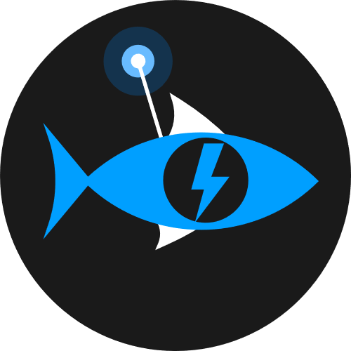

# FischBotDiscord-csharp

A Discord bot using Discord.NET.

## Prerequisites 

* Discord Bot Token

## How to get a Discord Bot Token

1. Visit the [Discord Developers Portal](http://discord.com/developers/applications)
2. Log in with your Discord Username and Password
3. Create a new Application, Name it your desired bot name.
4. Once created, click Bot in the left navigation menu.
5. Click add bot, and confirm with 'Yes, do it!'
6. Once the bot has been created, click 'Click to Reveal Token'
7. Save this token. >> DO NOT SHARE IT <<

## Getting started

1. Rename `sampleappsettings.config` to `appsettings.config`.
2. Edit `appsettings.config` and add your Discord bot token to it before running.
3. If you are running from the source code, this should be all you need to do besides running the solution in your IDE of choice.

**Note:** if you're running the project via Visual Studio, do the following to ensure your appsettings.config is output to the correct directory on runtime:
1. Right click `appsettings.config` and click Properties
2. In the properties section, set `Copy to Output Directory` to `Copy Always`

If you are using the a release package, do the following:

1. Unzip `linux-x64.zip`
1. Run `chmod +x ./FischBot` in the `linux-x64` directory
2. Run `./FischBot` to start the bot

## Contributing

Contributions are welcome! Please create a new branch for the item you are working on, and submit a pull request when it is ready.
